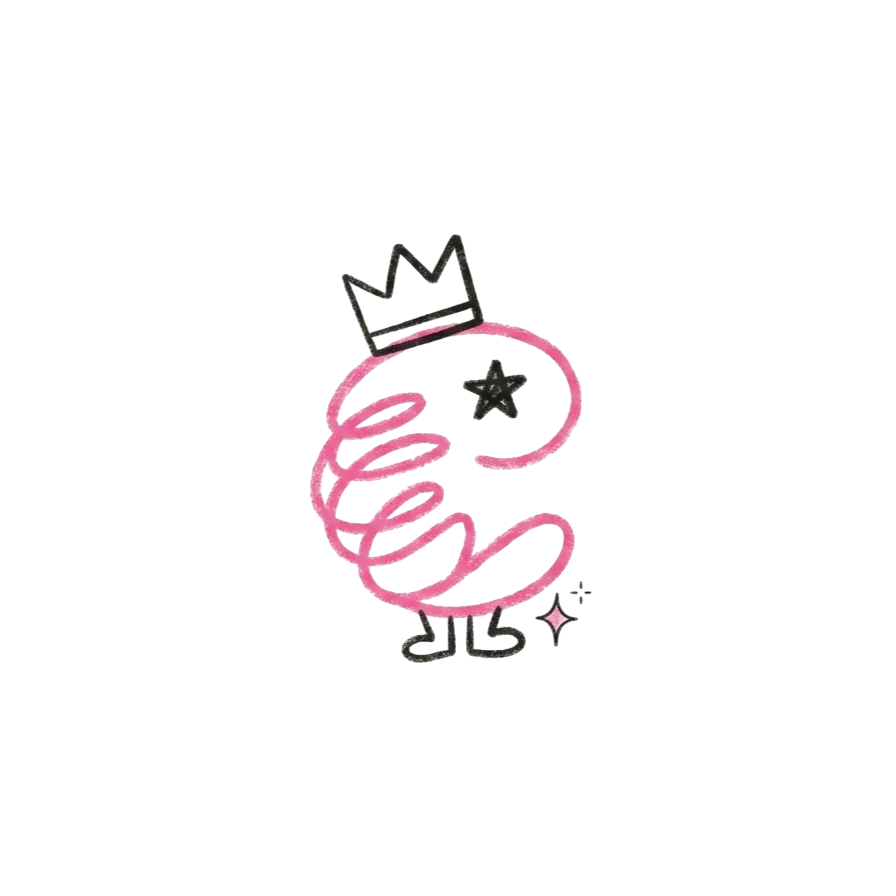

<div align="center">



# Scribbleee


<p align="center">
  
  
  
  
</p>

### The Whimsical Neo-Brutalist Font Studio & Decentralized Type Foundry

Where Sharp Monochrome Neo-Brutalism Meets Princess-Cute Aesthetic! Draw, animate, and publish bilingual English & Bangla fonts directly in your browser without ever logging in or touching a server database.

</div>

## Welcome to Scribbleee

Scribbleee is a revolutionary web-based typography studio that puts full creative font-making power directly into everyone's hands. No signup required. No login barriers. Just pure, unadulterated creative expression.

Designed with a bold black-and-white Neo-Brutalist structural foundation highlighted by cute pastel princess accents (pink, rose, lavender, and butter yellow), Scribbleee feels like a magical digital sketchbook where your handwriting comes alive as real, installable font software.

## Why Zero Database? The Open Community Layout

Building a vibrant, unstoppable community section for Scribbleee without setting up or paying for a traditional backend database is one of our proudest architectural triumphs. We offload data storage completely using two zero-infrastructure paradigms:

### Method 1: The GitHub Driven Archive (Git As A Backend)
Instead of saving fonts to a vulnerable database table, Scribbleee dynamically submits user-created fonts directly into a public GitHub repository using automated serverless APIs and Pull Requests.

* User Submits Font
* Serverless API Triggers Pull Request via GitHub API
* Automated GitHub Action Auto Merges Pull Request
* Scribbleee Community Page Reads Static JSON via CDN

#### How It Works
* The Collection File: We maintain a single public JSON file (community-fonts.json) inside our GitHub archive repository.
* Submitting Without Login: When an artist finishes crafting a font and clicks Upload to Community, a lightweight serverless function takes the metadata (name, author, glyph tags, and Base64 font string) and triggers the GitHub API to append it directly.
* The Display: The Scribbleee community page fetches the raw JSON archive via super-fast global CDNs like jsDelivr or GitHub Pages.

#### Why This Fits Perfectly
* 100% Free & Unlimited: GitHub handles all hosting, version histories, and global bandwidth costs forever.
* Built In Moderation Tool: No heavy admin dashboard needed. If someone uploads an inappropriate or broken font, moderation is as simple as deleting one line in a GitHub file from your phone.

### Method 2: IPFS & P2P Decentralized Storage
For total independence from centralized hosting providers, Scribbleee integrates with the InterPlanetary File System (IPFS) via open gateways.

* User Submits Font
* Direct Browser Upload To Peer To Peer IPFS Network
* Returns Immutable Unique Content Identifier (CID)
* Stored & Mirrored Globally Across Network Nodes

#### How It Works
* Direct Browser Upload: When published, your font binary compiles in browser memory and pushes directly into the peer-to-peer IPFS network.
* The Immutable Address: IPFS generates a cryptographic, permanent Content Identifier (CID) hash for the font.
* Universal Sharing: Anyone can download and preview the font instantly using simple public URLs like https://ipfs.io/ipfs/YOUR_FONT_HASH.

#### Why This Fits Perfectly
* Zero Infrastructure: No server bills, no user credentials to store, and total ownership belongs to the global community.
* Unstoppable Scaling: Millions of unique fonts can be added without increasing overhead by even one penny.

## Viral & Technical Feature Matrix

### Built In Algorithmic Font Templates
Never stare at an empty grid! Choose from three built-in mathematical curve styles and Bulk Fill every empty character instantly:
1. Dainty Script: Flowing, elegant cursive loops.
2. Bold Chunky: Thick, punchy Neo-Brutalist bubble typography.
3. Sketchy Doodle: Playful, high-energy multi-pass sketchbook lines.

### Full Bilingual Support (English & Bangla)
Craft typography across cultures! Scribbleee features dedicated glyph studios for:
* English Standard: A to Z, a to z, 0 to 9 plus standard punctuation.
* Full Bangla Script: Letters, numerals, vowel signs, and complex conjunct handling.

### Pure Client Side 4 Format Universal Export
Compile your custom splines into valid font files in milliseconds:
* TTF (TrueType Font): Universal support across Windows, macOS Font Book, Linux, and mobile apps.
* OTF (OpenType Font): Professional design workflows in Adobe Illustrator, Figma, and Photoshop.
* WOFF & WOFF2: Native, compressed web font formats ready for CSS @font-face embedding.

### 12 FPS Stop Motion Typographic Animation Engine
Replicate the tactile charm of paper flipbooks! Scribbleee features a pure-code typographic animation engine that generates 5 distinct geometric variants per letter and loops them independently at a snappy 12 FPS stop-motion pace without using heavy external GIFs or video assets.

### Live Type Tester & Instagram Story Generator
* Live @font-face Injection: Type real sample paragraphs in your font immediately while drafting.
* Instagram Ready: Export high-resolution type specimen PNGs or 1080x1920 WebM story videos customized for social media sharing.

## Quick Start Guide

Run Scribbleee on your local machine in under 30 seconds:

```bash
git clone https://github.com/labonysur-cloud/Scribbleee.git
cd Scribbleee
npm install
npm run dev
```

Open http://localhost:5173 in your browser and start crafting your custom fonts!

## Aesthetic Tokens & Neo Brutalism

```css
:root {
  /* Core Monochrome Foundation */
  --black: #0d0d0d;
  --white: #ffffff;
  --cream: #fbf9f5;

  /* Princess Cute Highlights */
  --pink: #ff85a1;
  --rose: #ffb3c6;
  --purple: #c5a3ff;
  --yellow: #fde047;

  /* Sharp Brutalist Shadows */
  --border: 2.5px solid var(--black);
  --shadow: 4px 4px 0px var(--black);
}
```

Crafted with love, sharp borders, and endless aesthetic doodles.
